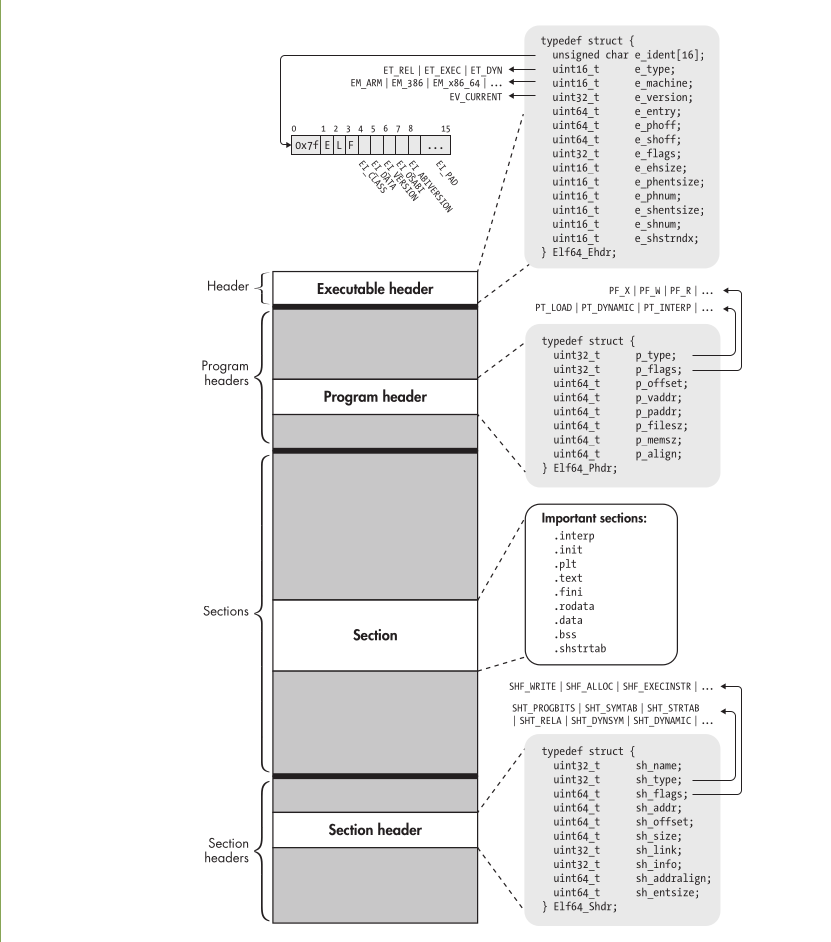

ELF binaries really consist of only four types of components: an executable header, a series of (optional) program headers, a number of sections, and a series of (optional) section headers, one per section

## HEADER ORDER 

[Executable Header](elf/executable_header.md) 
Program Header  
Section 
Section Header 

